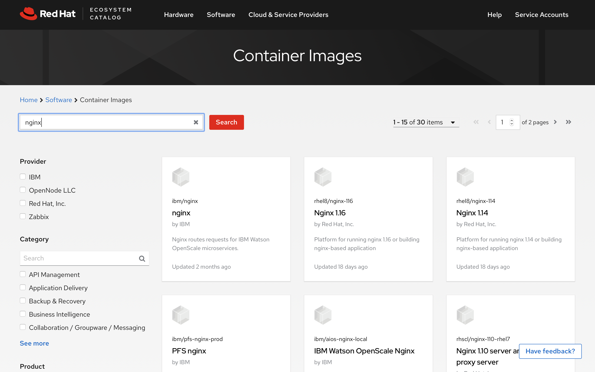
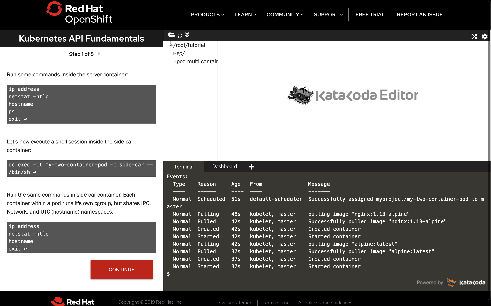

# Kubernetes API Fundamentals

使用下面链接可以直接进入场景
https://learn.openshift.com/operatorframework/k8s-api-fundamentals/
本场景用于帮助用户理解 Kubernetes API 的基础服务方式与如何提供 Operator API 给Operator 消费者或供应者。

场景的定义难度为初级，所需时间为30分钟
     Difficulty: beginner  Estimated Time: 30 minutes
但实际上他可以应用到的真实场景却远比场景介绍的要多且复杂。

快速链接
[场景说明](#场景说明)
[操作步骤](#操作步骤)
[其它](#其它)

#### 场景说明
Redhat 给该场景的说明

Before diving into the Operator Framework, this section will give an overview of Kubernetes API fundamentals. Although the Operator SDK makes creating an Operator fun and easy, understanding the structure and features of the Kubernetes API is required.

在深入讨论Operator框架之前，本节将概述Kubernetes API的基本原理。虽然OperatorSDK使创建一个操作员变得有趣和容易，但是需要理解KubernetesAPI的结构和特性。
除了官方解释外，以我个人的经验来看，其实这个场景可以用于 Kubernetes 部分能力的外联和外放上。Kubernetes 或是 OpenShift 都会供应核心的 API Server。 API Server 可以将平台的各种能力以 REST API 的形式直接提供给所有的平台 API 消费者使用。因此无论是我们给 Kubernetes 定制了一个门户，还是使用 OpenShift 自带的 Consle UI 抑或是给 OpenShift 又定义了一个个性化的 UI Portal 其本质都是在使用这个核心 API Server 的 API 能力。 这使得很多种场景的定制变得简单化。
比如我们现在经常自定义的多域 Kubernetes 、 多域 OpenShift、多集群统一管理、混合云管理，都可以基于 API 来定义实现。 包括很多时候 Kubernetes 或是 OpenShift 能力与外围某个业务系统的能力联动或混合都可以以这个 API 为基础实现。 且基于 API 的实现也可以确保用户 UI 与 Kubernetes 核心版本之间的送耦合。 按照现在企业级系统的发展频率来看，用户 UI 的更新与核心 PaaS 平台能力的更新往往是彼此交错的。依赖于 API 协调两者之间的版本交错是一个相当有效的保持系统有效性更新的手段。 
另一个方面，作为容器化 PaaS 平台， Kubernetes 调度核心和 OpenShift 这样的基本完备的 PaaS 平台融入用户自身的系统中，通常是与企业内部多系统多边整合交叉来完成 PaaS 植入的过程，通常需要与企业的 DevOps 体系多边整合，这种整合也需要一种可以供应指定角色权限范围内指向性对接机制。本场景中介绍的 OpenShift 提供的 ‘oc proxy’ 恰好是一种可以提供这种对接机制的外延体系。多数场景下，我们并不希望将 Server API 接口提供给外围使用，因为这意味着我们将 Kubernetes 所有的能力“裸露”提供给了外部，这将面临太多安全问题。因此主流的对外发布能力手段是通过在 OpenShift 内部以 Project 的形式开发一套交互 UI。再通过 UI 将能力发布给用户。但这种“官方模式”并不一定能够符合所有场景，比如与外部 DevOps 工具整合。像这种局部暴露能力场景我们通常希望能够快速、简单、有限的能力交给外部安全使用。 OpenShift 通过 oc 命令客户端体系提供了一种灵活的外延体系。首先我们可以通过 ‘oc’ 命令的认证来认证所在位置的 proxy 能力范围。其次通过简单的 ‘oc proxy [port]' 命令将所在位置作为 API 中转访问点，将能力提供给外部使用，使用户可以很简单的形成一个远程的前置节点。因此这个教学场景可以衍生出一系列复杂的外围操作模型。
当然作为一个原理展示的简单例子，本场景设计之初并没有考虑更多复杂的问题。其中有很多没有涉及到的内容。例如如何与认证体系挂钩，‘oc proxy’ 命令需要又集群管理角色才能使用，那么如何设计一个合理的角色来实现中转是我们需要考虑的问题。此外如何限制使用者使用 API 的能力范围也没有在本场景中设计，需要我们自己考虑。

#### 操作过程
[1] 第一步，建立项目：

```
oc new-project myproject
```

[2] 第二步，建立 Pod 描述文件：
设计多容器单Pod项目描述文件 Menifest file。
在 Kubernetes 和 OpenShift 的学习过程中经常会有一个误区，认为一个 Pod 就是一个容器，这是不对的。 一个 Pod 代表一个部署位置（Position of Deployment Pod ，这里和物理机房部署用的 POD 用词是一样的，因此在讨论或文章里一定要注意，通常 Kubernetes Pod 不会全用大写，而机房 POD 会全用大写）因此一个 Pod 通常被定义为一个元素级部署逻辑。比如下面这个部署描述中所展示的这个例子，它是一个 Nginx + 它的 SideCar 的联合部署。 这样的用法非常典型，他可以确保一个完整的支撑逻辑可以同时启停及同时扩缩容，非常有利于服务的原子化设计。
以下这个 YAML 文件描述了一个完整的部署逻辑，其中包括了部署的内容类型是一个 Pod ，‘kind： Pod’。 标记希望用于开发环境，‘labels： environment： dev’ 。在 ‘spec’ 中描述了这个部署有两个容器， ‘containers’ 有两个 name 和 image ，在特定的image描述中还要提供基础要求的参数，比如 nginx ，需要指定相应的 containerPort:80 和协议 protocal:TCP 。:
```
cat > pod-multi-container.yaml <<EOF
apiVersion: v1
kind: Pod
metadata:
  name: my-two-container-pod
  namespace: myproject
  labels:
    environment: dev
spec:
  containers:
    - name: server
      image: nginx:1.13-alpine
      ports:
        - containerPort: 80
          protocol: TCP
    - name: side-car
      image: alpine:latest
      command: ["/usr/bin/tail", "-f", "/dev/null"]
  restartPolicy: Never
EOF
```
关于 Nginx 这个镜像的细节可以到下列网站中去了解。 
https://github.com/nginxinc/docker-nginx/blob/a973c221f6cedede4dab3ab36d18240c4d3e3d74/mainline/alpine/Dockerfile
https://hub.docker.com/layers/nginx/library/nginx/1.17.6-alpine/images/sha256-cdf5e75dc8f0afda8614680d6a3aaf77807943e961ea9c0d5a09c5b6f69ff702

选择 Image 镜像很重要，初学者为了方便通常随便从网上查找一个就使用，这非常容易带来安全与稳定性方面的隐患。对于企业使用来讲最好选择一些企业提供的官方镜像，例如在 Redhat 公司的官方镜像网站上下载。
https://catalog.redhat.com/software/containers/explore


[3] 第三步，基于 Pod 描述文件建立 Pod：
有了上面的 manifest 文件（YAML文件）就可以在 OpenShift 上快速建立一个完整的 Nginx 运行环境（包括两个容器 Containers），一个命令就可以搞定:
```
oc create -f pod-multi-container.yaml
```
这个命令除了在本场景中执行，也可以在任何一个 OpenShift 环境中执行，(oc 是 Orgin Openshift 的客户端命令，Kubernetes 是没有这个命令的，Kubernetes 需要用 kubectl 命令)前提是你的 OpenShift 所注册的镜像库必须要拥有这个版本的 niginx 镜像，和 Sidecar 用到的 alpine 基础镜像。有不少企业在真实环境中是不能够直连互联网的。而 OpenShift 的默认基础安装是认为 OpenShift 所在环境可以访问互联网，并通过签名将相应的指定镜像自动引入 OpenShift 安装时所配置的中央镜像库，使基于 OpenShift 开发的用户可以使用特定的镜像。 如果所在环境无法直连互联网将导致镜像引入失败，从而无法完成操作，这个问题需要配置离线镜像库来解决，配置离线镜像库是一个复杂的工作，在这里不深入讨论，建议如果需要配置离线镜像库的朋友一定要找 Redhat 的顾问或专家，由专家给出符合具体企业环境的建议方案。

[*] 可选步骤，对于熟知 OpenShift （Kubernets）原理的朋友就可以忽略以下内容，以下内容主要是为了向用户展示多容器 Pod 的底层资源关系：
完成了上述命令就可以通过下面这个命令来查看 Pod 在建立过程中所有的事件流
View the detail for the pod and look at the events:
```
oc describe pod my-two-container-pod
```

同样通过下面这个命令可以进入 Container 容器，使用 sh 来执行各种标准 Linux 操作命令（前提是这个镜像里包含了你想要执行的命令，很多容器是精简过的，为了稳定且高效，镜像通常会将所有不需要的命令都排除。）
使用 ‘-c’ 参数来制定登陆到那个 Container 中（别忘了你的 Pod 有两个 Container）。 ‘-c server’ 是因为在上面 Manifest 文件里我们将 'image: nginx:1.13-alpine' 镜像的 ‘-name: server’ 指定为 server 这个名字。
Let's first execute a shell session inside the server container by using the -c flag:
```
oc exec -it my-two-container-pod -c server -- /bin/sh
```
登陆入容器 ‘sh’ 后你可以执行以下命令：
```
ip address
netstat -ntlp
hostname
ps
exit
```
这些命令都是 nginx 镜像包含的。

在 Side-car 容器中可以执行以下命令， 这个场景中的 Side-car 容器是一个摆设，只是在 aphine linux 上执行了一个空输出 ‘tail -f /dev/null’ ， 之所以需要执行这样一个空输出是因为 Kubernetes 将容器调度起来后需要由容器自己决定自己的“生死”。 如果在基础镜像中不包含持续执行的独占进程时，容器会自动执行完毕并退出，Kubernetes 则认为容器自己认为自己 “已死” 然后重启容器，这样就会陷入一个循环，多次循环（根据 Kubernetes 参数配置决定多少次）后 Kubernetes 会认为 Pod 处于不可恢复状态，并报知 Kubernetes 调度体系，在监控上可以看得到。
```
oc exec -it my-two-container-pod -c side-car -- /bin/sh
```

在 side-car 容器中也可以执行刚才那些命令，你会获得部分相同的结果，包括 ip、hostname 等，这是为了展示一下多容器 Pod 实际上在底层操作系统上会为每个容器产生单独的 cgroup ，但是会共享 IPC、网络、UTC namespace（）等基础资源，OpenShift （Kubernetes） 在调度他们的时候，它们会永远在一起，而不会分到不同的主机上去。
Run the same commands in side-car container. Each container within a pod runs it's own cgroup, but shares IPC, Network, and UTC (hostname) namespaces:
```
ip address
netstat -ntlp
hostname
exit
```

###### 其它
实验的执行结果如下，：
```
$ oc exec -it my-two-container-pod -c server -- /bin/sh
/ # ip address
1: lo: <LOOPBACK,UP,LOWER_UP> mtu 65536 qdisc noqueue state UNKNOWN qlen 1
    link/loopback 00:00:00:00:00:00 brd 00:00:00:00:00:00
    inet 127.0.0.1/8 scope host lo
       valid_lft forever preferred_lft forever
    inet6 ::1/128 scope host
       valid_lft forever preferred_lft forever
3: eth0@if29: <BROADCAST,MULTICAST,UP,LOWER_UP,M-DOWN> mtu 1450 qdisc noqueue state UP
    link/ether 0a:58:0a:80:00:17 brd ff:ff:ff:ff:ff:ff
    inet 10.128.0.23/23 brd 10.128.1.255 scope global eth0
       valid_lft forever preferred_lft forever
    inet6 fe80::a88e:7bff:fe20:a406/64 scope link
       valid_lft forever preferred_lft forever
/ # netstat -ntlp
Active Internet connections (only servers)
Proto Recv-Q Send-Q Local Address           Foreign Address         State       PID/Program name
tcp        0      0 0.0.0.0:80              0.0.0.0:*               LISTEN      1/nginx: master pro
/ # hostname
my-two-container-pod
/ # ps
PID   USER     TIME   COMMAND
    1 root       0:00 nginx: master process nginx -g daemon off;
    8 nginx      0:00 nginx: worker process
    9 root       0:00 /bin/sh
   18 root       0:00 ps
/ # exit
$
$
$ oc exec -it my-two-container-pod -c side-car -- /bin/sh
/ # ip address
1: lo: <LOOPBACK,UP,LOWER_UP> mtu 65536 qdisc noqueue state UNKNOWN qlen 1
    link/loopback 00:00:00:00:00:00 brd 00:00:00:00:00:00
    inet 127.0.0.1/8 scope host lo
       valid_lft forever preferred_lft forever
    inet6 ::1/128 scope host
       valid_lft forever preferred_lft forever
3: eth0@if29: <BROADCAST,MULTICAST,UP,LOWER_UP,M-DOWN> mtu 1450 qdisc noqueue state UP
    link/ether 0a:58:0a:80:00:17 brd ff:ff:ff:ff:ff:ff
    inet 10.128.0.23/23 brd 10.128.1.255 scope global eth0
       valid_lft forever preferred_lft forever
    inet6 fe80::a88e:7bff:fe20:a406/64 scope link
       valid_lft forever preferred_lft forever
/ # netstat -ntlp
Active Internet connections (only servers)
Proto Recv-Q Send-Q Local Address           Foreign Address         State       PID/Program name
tcp        0      0 0.0.0.0:80              0.0.0.0:*               LISTEN      -
/ # hostname
my-two-container-pod
/ # ps
PID   USER     TIME  COMMAND
    1 root      0:00 /usr/bin/tail -f /dev/null
   17 root      0:00 /bin/sh
   24 root      0:00 ps
/ #
/ # exit
$
```
对比可以看到 ‘ip address’ 一样，hostname 一样，netstat 不完全一样（ side-car 可以看见监听 80 端口，可是无法看到 PID/Program name），‘ps’ 完全不一样。这就是两个 Container Pod 的基础原理。


注意上面这个截图，不管是不是在 Katacoda 上，成功建立 Pod 都会是如下显示（在 oc 客户端登陆到远程 OpenShift 时一样有效）。 Katacoda 厉害的地方是会帮你展示一个你操作过文件的目录，方便你操作自己曾经编写的文件及目录。
